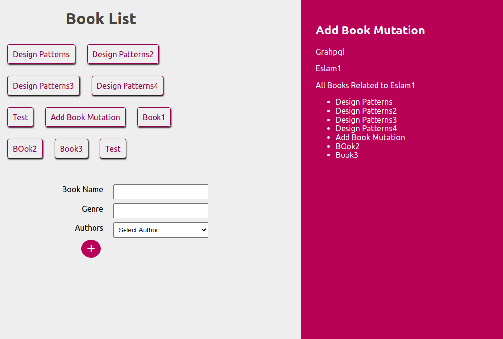

# Reading Social Media Web Application
This Project Related to Reading Website Where can add Books & Authors Each Author Has Many books a Simple Scenario
# Project Dependencies
  - GraphQL Server For Back-end
  - Nodejs (Express FrameWork)
  - MongoDB
  - React Apollo To Fetch Data from your GraphQL server
  - Reactjs
  
# Installation
After download or clone the repo, you need to follow this steps to have the development environment running :
  - Install dependencies : npm install
  - go to Client Folder and also Make npm install to install Reactjs dependencies
  - nodemon to Run Server
  - npm start to run Client
  
# Project Pictures

